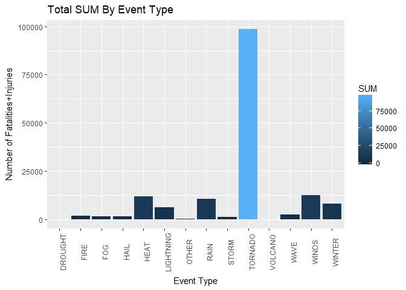
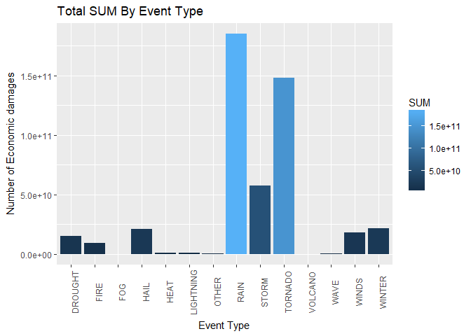

# Peer-graded Assignment: Course Project 2. Health and Economic effects of Weather events in the United States

##Synopsis
We analyzed natural events datafrom he U.S. National Oceanic and Atmospheric Administration’s (NOAA) storm database.
This database tracks characteristics of major storms and weather events in the United States, including when and where they occur, as well as estimates of any fatalities, injuries, and property damage.

Key questions to address:

 1. Across the United States, which types of events are most harmful with respect to population health?

 2. Across the United States, which types of events have the greatest economic consequences?
 


```
## 
## Attaching package: 'dplyr'
```

```
## The following objects are masked from 'package:stats':
## 
##     filter, lag
```

```
## The following objects are masked from 'package:base':
## 
##     intersect, setdiff, setequal, union
```

```
## 
## Attaching package: 'lubridate'
```

```
## The following object is masked from 'package:base':
## 
##     date
```

```
## Loading required package: R.oo
```

```
## Loading required package: R.methodsS3
```

```
## R.methodsS3 v1.7.1 (2016-02-15) successfully loaded. See ?R.methodsS3 for help.
```

```
## R.oo v1.21.0 (2016-10-30) successfully loaded. See ?R.oo for help.
```

```
## 
## Attaching package: 'R.oo'
```

```
## The following objects are masked from 'package:methods':
## 
##     getClasses, getMethods
```

```
## The following objects are masked from 'package:base':
## 
##     attach, detach, gc, load, save
```

```
## R.utils v2.5.0 (2016-11-07) successfully loaded. See ?R.utils for help.
```

```
## 
## Attaching package: 'R.utils'
```

```
## The following object is masked from 'package:utils':
## 
##     timestamp
```

```
## The following objects are masked from 'package:base':
## 
##     cat, commandArgs, getOption, inherits, isOpen, parse, warnings
```

```
## -------------------------------------------------------------------------
```

```
## You have loaded plyr after dplyr - this is likely to cause problems.
## If you need functions from both plyr and dplyr, please load plyr first, then dplyr:
## library(plyr); library(dplyr)
```

```
## -------------------------------------------------------------------------
```

```
## 
## Attaching package: 'plyr'
```

```
## The following object is masked from 'package:lubridate':
## 
##     here
```

```
## The following objects are masked from 'package:dplyr':
## 
##     arrange, count, desc, failwith, id, mutate, rename, summarise,
##     summarize
```

```
## Warning: package 'plotly' was built under R version 3.4.2
```

```
## 
## Attaching package: 'plotly'
```

```
## The following objects are masked from 'package:plyr':
## 
##     arrange, mutate, rename, summarise
```

```
## The following object is masked from 'package:ggplot2':
## 
##     last_plot
```

```
## The following object is masked from 'package:stats':
## 
##     filter
```

```
## The following object is masked from 'package:graphics':
## 
##     layout
```
##Data Processing
We load the data from the course web site.  

```r
if(!file.exists("E:/R/Reproducible Research/4/Assignment")){dir.create("E:/R/Reproducible Research/4/Assignment")}
url<-"https://d396qusza40orc.cloudfront.net/repdata%2Fdata%2FStormData.csv.bz2"
download.file(url, "E:/R/Reproducible Research/4/Assignment/Data_Assessment.csv.bz2",method="auto") 
bunzip2("Data_Assessment.csv.bz2", "Data_Assessment.csv", remove = FALSE, skip = TRUE)
```

```
## [1] "Data_Assessment.csv"
## attr(,"temporary")
## [1] FALSE
```

```r
dataset <- read.csv("Data_Assessment.csv",header = TRUE, sep = ",")

names(dataset)
```

```
##  [1] "STATE__"    "BGN_DATE"   "BGN_TIME"   "TIME_ZONE"  "COUNTY"    
##  [6] "COUNTYNAME" "STATE"      "EVTYPE"     "BGN_RANGE"  "BGN_AZI"   
## [11] "BGN_LOCATI" "END_DATE"   "END_TIME"   "COUNTY_END" "COUNTYENDN"
## [16] "END_RANGE"  "END_AZI"    "END_LOCATI" "LENGTH"     "WIDTH"     
## [21] "F"          "MAG"        "FATALITIES" "INJURIES"   "PROPDMG"   
## [26] "PROPDMGEXP" "CROPDMG"    "CROPDMGEXP" "WFO"        "STATEOFFIC"
## [31] "ZONENAMES"  "LATITUDE"   "LONGITUDE"  "LATITUDE_E" "LONGITUDE_"
## [36] "REMARKS"    "REFNUM"
```

```r
## we keep the col that we need for the analisys and we make a new variable with only that. 

stormdata <- dataset[c("EVTYPE", "FATALITIES", "INJURIES", "PROPDMG", "PROPDMGEXP", "CROPDMG", "CROPDMGEXP")]
head(stormdata)
```

```
##    EVTYPE FATALITIES INJURIES PROPDMG PROPDMGEXP CROPDMG CROPDMGEXP
## 1 TORNADO          0       15    25.0          K       0           
## 2 TORNADO          0        0     2.5          K       0           
## 3 TORNADO          0        2    25.0          K       0           
## 4 TORNADO          0        2     2.5          K       0           
## 5 TORNADO          0        2     2.5          K       0           
## 6 TORNADO          0        6     2.5          K       0
```

```r
##some of the data at EVTYPE is in lowercase, we change it to all capital
stormdata$EVTYPE = toupper(stormdata$EVTYPE)
```
Lets see  what types of events do we have. 

```r
head(names(table(stormdata$EVTYPE)))
```

```
## [1] "   HIGH SURF ADVISORY" " COASTAL FLOOD"        " FLASH FLOOD"         
## [4] " LIGHTNING"            " TSTM WIND"            " TSTM WIND (G45)"
```
So we going to group the EVTYPE variable and create a new one, puting togethe names with the the same meaning. For example, in the class "RAIN" we going to put the the expressions: "RAIN","HEAVY RAIN", "FLOOD","FLASH FLOOD", "URBAN/SML STREAM FLD", "FLASH FLOODING", "FLOOD/FLASH FLOOD", etc. According to cookbooκ.

```r
stormdata <- stormdata %>%
  mutate(EVTYPEGRP = 
   ifelse(grepl("HAIL", EVTYPE), "HAIL",
    ifelse(grepl("LIGHTNING|LIGHTING|LIGNTNING", EVTYPE), "LIGHTNING",
     ifelse(grepl("RAIN|FLOOD|WET|FLD|FLOODING", EVTYPE), "RAIN",
      ifelse(grepl("SNOW|WINTER|WINTRY|BLIZZARD|SLEET|COLD|ICE|FREEZE|AVALANCHE|ICY|WINDCHILL|FROST|MIXED+PRECIPITATION|FREEZING", EVTYPE), "WINTER",
       ifelse(grepl("TORNADO|TORNDAO|TYPHOON|FUNNEL|WATERSPOUT|WATERSPOUTS|HURRICANE|WAYTERSPOUT|WATER SPOUT", EVTYPE), "TORNADO",
        ifelse(grepl("WIND|WINDS|WINDSS", EVTYPE), "WINDS",
         ifelse(grepl("STORM|THUNDER|TSTM|TROPICAL +STORM|DUST+DEVIL|TROPICAL DEPRESSION", EVTYPE), "STORM",
          ifelse(grepl("FIRE|WILDFIRE", EVTYPE), "FIRE",
           ifelse(grepl("FOG|VISIBILITY|DARK|DUST|GLAZE", EVTYPE), "FOG",
            ifelse(grepl("WAVE|SURF|SURGE|TIDE|TSUNAMI|CURRENT|SWELL", EVTYPE), "WAVE",
             ifelse(grepl("HEAT|HIGH +TEMP|RECORD +TEMP|WARM|DRY", EVTYPE), "HEAT",
              ifelse(grepl("VOLCAN", EVTYPE), "VOLCANO",
               ifelse(grepl("DROUGHT", EVTYPE), "DROUGHT",
               "OTHER")))))))))))))

  )

names(table(stormdata$EVTYPEGRP))
```

```
##  [1] "DROUGHT"   "FIRE"      "FOG"       "HAIL"      "HEAT"     
##  [6] "LIGHTNING" "OTHER"     "RAIN"      "STORM"     "TORNADO"  
## [11] "VOLCANO"   "WAVE"      "WINDS"     "WINTER"
```
If we want to see what kind of data went in the "VOLCANO" class. 

```r
names(table(stormdata[which(stormdata$EVTYPEGRP=="VOLCANO") , ]$EVTYPE))
```

```
## [1] "VOLCANIC ASH"       "VOLCANIC ASH PLUME" "VOLCANIC ASHFALL"  
## [4] "VOLCANIC ERUPTION"
```
Or we can see what kind of data fall into the class "OTHER", and mabe add in the if some staf if we found something we want to correct. 

```r
head(names(table(stormdata[which(stormdata$EVTYPEGRP=="OTHER") , ]$EVTYPE)))
```
<br/>

We fix our data set (for now we going to keep it that way), so know we want to find which types of events are most harmful with respect to population health?

First we going to look at the fatalities variable.So we summarize data. 

```r
stormdatasum<-aggregate(cbind(FATALITIES,INJURIES) ~ EVTYPEGRP, stormdata, sum)
stormdatasum
```

```
##    EVTYPEGRP FATALITIES INJURIES
## 1    DROUGHT          0        4
## 2       FIRE         90     1608
## 3        FOG         89     1335
## 4       HAIL         45     1467
## 5       HEAT       3000     8877
## 6  LIGHTNING        817     5232
## 7      OTHER         92      106
## 8       RAIN       1666     8988
## 9      STORM        117      907
## 10   TORNADO       5774    92772
## 11   VOLCANO          0        0
## 12      WAVE        951     1300
## 13     WINDS       1174    11299
## 14    WINTER       1330     6633
```
As we can see first is the tornado (by far).  

```r
stormdatasum[which.max(stormdatasum$FATALITIES),]$EVTYPEGRP
```

```
## [1] "TORNADO"
```
 
And then we going to look at the injuries. As we can see first is the tornado (by far). 

```r
stormdatasum[which.max(stormdatasum$INJURIES),]$EVTYPEGRP
```

```
## [1] "TORNADO"
```

Now lets see what the data for the types of events have the greatest economic consequences, looks like.
 

```r
summary(stormdata$PROPDMGEXP)
```

```
##             -      ?      +      0      1      2      3      4      5 
## 465934      1      8      5    216     25     13      4      4     28 
##      6      7      8      B      h      H      K      m      M 
##      4      5      1     40      1      6 424665      7  11330
```

```r
summary(stormdata$CROPDMGEXP)
```

```
##             ?      0      2      B      k      K      m      M 
## 618413      7     19      1      9     21 281832      1   1994
```
According to page 12 from the cookbook, there are several conventions to easy figure reading and calculations: “K” stands for thousands, “M” for millions and “B” for billions. We need to standarize the upper and lower case from those. First, we transform exponential values to actual numbers.


```r
stormdata <- stormdata %>%
  mutate(PROPDMGEXP2 = 
   ifelse(grepl("- | ? | +", PROPDMGEXP), "0",
    ifelse(grepl("0", PROPDMGEXP), "1",
     ifelse(grepl("1", PROPDMGEXP), "10",
      ifelse(grepl("2|H|h", PROPDMGEXP), "100",
       ifelse(grepl("3|K", PROPDMGEXP), "1000",
        ifelse(grepl("4", PROPDMGEXP), "10000",
         ifelse(grepl("5", PROPDMGEXP), "100000",
          ifelse(grepl("6|M|m", PROPDMGEXP), "1000000",
           ifelse(grepl("7", PROPDMGEXP), "10000000",
            ifelse(grepl("8", PROPDMGEXP), "100000000",
             ifelse(grepl("B", PROPDMGEXP), "1000000000",
               "0")))))))))))

  )
stormdata$PROPDMGEXP2<-as.numeric(stormdata$PROPDMGEXP2)
##now we make a new col named PROPDMGTOTAL how have the total PROPDMG*PROPDMGEXP2 (as we can see at the cookbook)
stormdata$PROPDMGTOTAL <- (stormdata$PROPDMG * stormdata$PROPDMGEXP2)
```
<br/>
We convert property damage units and now we going to do the same for crop damage units. 


```r
stormdata <- stormdata %>%
  mutate(CROPDMGEXP2 = 
   ifelse(grepl("- | ? | +", CROPDMGEXP), "0",
    ifelse(grepl("0", CROPDMGEXP), "1",
     ifelse(grepl("1", CROPDMGEXP), "10",
      ifelse(grepl("2|H|h", CROPDMGEXP), "100",
       ifelse(grepl("3|K", CROPDMGEXP), "1000",
        ifelse(grepl("4", CROPDMGEXP), "10000",
         ifelse(grepl("5", CROPDMGEXP), "100000",
          ifelse(grepl("6|M|m", CROPDMGEXP), "1000000",
           ifelse(grepl("7", CROPDMGEXP), "10000000",
            ifelse(grepl("8", CROPDMGEXP), "100000000",
             ifelse(grepl("B", CROPDMGEXP), "1000000000",
               "0")))))))))))

  )
stormdata$CROPDMGEXP2<-as.numeric(stormdata$CROPDMGEXP2)
##now we make a new col named CROPDMGTOTAL how have the total CROPDMG*CROPDMGEXP2 (as we can see at the cookbook)
stormdata$CROPDMGTOTAL <- (stormdata$CROPDMG * stormdata$CROPDMGEXP2)
```
<br/>

So now we can calculate the total economic damage. 


```r
## we summarize the data
stormeconomicsum<-aggregate(cbind(PROPDMGTOTAL,CROPDMGTOTAL) ~ EVTYPEGRP, stormdata, sum)
##and make a new col named SUM=PROPDMGTOTAL+CROPDMGTOTAL
stormeconomicsum <- mutate(stormeconomicsum,SUM=PROPDMGTOTAL+CROPDMGTOTAL)
stormeconomicsum
```

```
##    EVTYPEGRP PROPDMGTOTAL CROPDMGTOTAL          SUM
## 1    DROUGHT   1046106000  13972566000  15018672000
## 2       FIRE   8496628500    403281630   8899910130
## 3        FOG     24568130            0     24568130
## 4       HAIL  17622991456   3113795870  20736787326
## 5       HEAT     16398300    898894280    915292580
## 6  LIGHTNING    940737927     12097090    952835017
## 7      OTHER    333826700     21052950    354879650
## 8       RAIN 171520285429  13407750000 184928035429
## 9      STORM  56894914100    717056000  57611970100
## 10   TORNADO 142369492624   5931079270 148300571894
## 11   VOLCANO       500000            0       500000
## 12      WAVE    266625200      5620000    272245200
## 13     WINDS  16003453493   1939455130  17942908623
## 14    WINTER  12688340251   8681107950  21369448201
```
First we going to look at the property variable. 

```r
stormeconomicsum[which.max(stormeconomicsum$PROPDMGTOTAL),]$EVTYPEGRP
```

```
## [1] "RAIN"
```
As we can see first is the rain and then we going to look at the crop.


```r
stormeconomicsum[which.max(stormeconomicsum$CROPDMGTOTA),]$EVTYPEGRP
```

```
## [1] "DROUGHT"
```
As we can see first is the drought. 

<br/>

**One note, as we see the total for the "OTHER" variable, in both groups the fatalities and injuries and the property and crop, is very small in contrast with the other numbers. So we know we didn't loss any sirius data in the last    class.**  


##Results

<br/>
Now lets look at the result of our analisys.

###1. Across the United States, which types of events (as indicated in the EVTYPE variable) are most harmful with respect to population health?
The following graph is the sum cost of the fatalities and injuries, together. 


```r
stormdatasum <- mutate(stormdatasum,SUM=FATALITIES+INJURIES)
ggplot(stormdatasum, aes(EVTYPEGRP,SUM, fill=SUM))+
  geom_bar(stat = "identity",position = position_stack(reverse = TRUE))+
  xlab("Event Type")+ ylab("Number of Fatalities+Injuries")+
  ggtitle("Total SUM By Event Type")+
  theme(axis.text.x = element_text(angle=90)) +
  expand_limits(y=c(0,10000))
```

<!-- -->
<br/>
In the following graph we can see the sum cost of the fatalities and injuries and which did what. 


```r
plot_ly(stormdatasum, x= ~EVTYPEGRP, y= ~FATALITIES, type = 'bar', name = 'Fatal', width = 800, height = 500) %>%
        add_trace(y= ~INJURIES, name='Injury') %>%
        layout(title = "Top 10 events most hurtful to public health", yaxis = list(title = 'Number'), xaxis = list(title = 'Eventtype', tickangle = -45), barmode = 'stack', margin = list(b = 150))
```

<!--html_preserve--><div id="4b039164b3d" style="width:800px;height:500px;" class="plotly html-widget"></div>
<script type="application/json" data-for="4b039164b3d">{"x":{"visdat":{"4b05e185b19":["function () ","plotlyVisDat"]},"cur_data":"4b05e185b19","attrs":{"4b05e185b19":{"x":{},"y":{},"name":"Fatal","alpha":1,"sizes":[10,100],"type":"bar"},"4b05e185b19.1":{"x":{},"y":{},"name":"Injury","alpha":1,"sizes":[10,100],"type":"bar"}},"layout":{"width":800,"height":500,"margin":{"b":150,"l":60,"t":25,"r":10},"title":"Top 10 events most hurtful to public health","yaxis":{"domain":[0,1],"title":"Number"},"xaxis":{"domain":[0,1],"title":"Eventtype","tickangle":-45,"type":"category","categoryorder":"array","categoryarray":["DROUGHT","FIRE","FOG","HAIL","HEAT","LIGHTNING","OTHER","RAIN","STORM","TORNADO","VOLCANO","WAVE","WINDS","WINTER"]},"barmode":"stack","hovermode":"closest","showlegend":true},"source":"A","config":{"modeBarButtonsToAdd":[{"name":"Collaborate","icon":{"width":1000,"ascent":500,"descent":-50,"path":"M487 375c7-10 9-23 5-36l-79-259c-3-12-11-23-22-31-11-8-22-12-35-12l-263 0c-15 0-29 5-43 15-13 10-23 23-28 37-5 13-5 25-1 37 0 0 0 3 1 7 1 5 1 8 1 11 0 2 0 4-1 6 0 3-1 5-1 6 1 2 2 4 3 6 1 2 2 4 4 6 2 3 4 5 5 7 5 7 9 16 13 26 4 10 7 19 9 26 0 2 0 5 0 9-1 4-1 6 0 8 0 2 2 5 4 8 3 3 5 5 5 7 4 6 8 15 12 26 4 11 7 19 7 26 1 1 0 4 0 9-1 4-1 7 0 8 1 2 3 5 6 8 4 4 6 6 6 7 4 5 8 13 13 24 4 11 7 20 7 28 1 1 0 4 0 7-1 3-1 6-1 7 0 2 1 4 3 6 1 1 3 4 5 6 2 3 3 5 5 6 1 2 3 5 4 9 2 3 3 7 5 10 1 3 2 6 4 10 2 4 4 7 6 9 2 3 4 5 7 7 3 2 7 3 11 3 3 0 8 0 13-1l0-1c7 2 12 2 14 2l218 0c14 0 25-5 32-16 8-10 10-23 6-37l-79-259c-7-22-13-37-20-43-7-7-19-10-37-10l-248 0c-5 0-9-2-11-5-2-3-2-7 0-12 4-13 18-20 41-20l264 0c5 0 10 2 16 5 5 3 8 6 10 11l85 282c2 5 2 10 2 17 7-3 13-7 17-13z m-304 0c-1-3-1-5 0-7 1-1 3-2 6-2l174 0c2 0 4 1 7 2 2 2 4 4 5 7l6 18c0 3 0 5-1 7-1 1-3 2-6 2l-173 0c-3 0-5-1-8-2-2-2-4-4-4-7z m-24-73c-1-3-1-5 0-7 2-2 3-2 6-2l174 0c2 0 5 0 7 2 3 2 4 4 5 7l6 18c1 2 0 5-1 6-1 2-3 3-5 3l-174 0c-3 0-5-1-7-3-3-1-4-4-5-6z"},"click":"function(gd) { \n        // is this being viewed in RStudio?\n        if (location.search == '?viewer_pane=1') {\n          alert('To learn about plotly for collaboration, visit:\\n https://cpsievert.github.io/plotly_book/plot-ly-for-collaboration.html');\n        } else {\n          window.open('https://cpsievert.github.io/plotly_book/plot-ly-for-collaboration.html', '_blank');\n        }\n      }"}],"cloud":false},"data":[{"x":["DROUGHT","FIRE","FOG","HAIL","HEAT","LIGHTNING","OTHER","RAIN","STORM","TORNADO","VOLCANO","WAVE","WINDS","WINTER"],"y":[0,90,89,45,3000,817,92,1666,117,5774,0,951,1174,1330],"name":"Fatal","type":"bar","marker":{"fillcolor":"rgba(31,119,180,1)","color":"rgba(31,119,180,1)","line":{"color":"transparent"}},"xaxis":"x","yaxis":"y","frame":null},{"x":["DROUGHT","FIRE","FOG","HAIL","HEAT","LIGHTNING","OTHER","RAIN","STORM","TORNADO","VOLCANO","WAVE","WINDS","WINTER"],"y":[4,1608,1335,1467,8877,5232,106,8988,907,92772,0,1300,11299,6633],"name":"Injury","type":"bar","marker":{"fillcolor":"rgba(255,127,14,1)","color":"rgba(255,127,14,1)","line":{"color":"transparent"}},"xaxis":"x","yaxis":"y","frame":null}],"highlight":{"on":"plotly_click","persistent":false,"dynamic":false,"selectize":false,"opacityDim":0.2,"selected":{"opacity":1}},"base_url":"https://plot.ly"},"evals":["config.modeBarButtonsToAdd.0.click"],"jsHooks":{"render":[{"code":"function(el, x) { var ctConfig = crosstalk.var('plotlyCrosstalkOpts').set({\"on\":\"plotly_click\",\"persistent\":false,\"dynamic\":false,\"selectize\":false,\"opacityDim\":0.2,\"selected\":{\"opacity\":1}}); }","data":null}]}}</script><!--/html_preserve-->

<br/>

As we can see the 5 events who are most harmful (with respect to population health), are:

 1. TORNADO (by far)
 2. WINDS
 3. HEAT
 4. RAIN
 5. WINTER
 
 <br/>
 
###2. Across the United States, which types of events have the greatest economic consequences?

The following graph is the sum cost of the property and crop, together.


```r
ggplot(stormeconomicsum, aes(EVTYPEGRP,SUM, fill=SUM))+
geom_bar(stat = "identity",position = position_stack(reverse = TRUE))+
xlab("Event Type")+ ylab("Number of Economic damages")+
ggtitle("Total SUM By Event Type")+
theme(axis.text.x = element_text(angle=90)) +
expand_limits(y=c(0,10^11))
```

<!-- -->

<br/>
In the following graph we can see the sum cost of the property and crop and which did what. 

```r
plot_ly(stormeconomicsum, x= ~EVTYPEGRP, y= ~PROPDMGTOTAL, type = 'bar', name = 'Value property damage', width = 800, height = 500) %>%
        add_trace(y= ~CROPDMGTOTAL, name='Value crop damage') %>%
        layout(title = "Top 10 events highest economic damage", yaxis = list(title = 'Value of damage'), xaxis = list(title = 'Eventtype', tickangle = -45), barmode = 'stack', margin = list(b = 150))
```

<!--html_preserve--><div id="4b02b517be6" style="width:800px;height:500px;" class="plotly html-widget"></div>
<script type="application/json" data-for="4b02b517be6">{"x":{"visdat":{"4b0d6446c1":["function () ","plotlyVisDat"]},"cur_data":"4b0d6446c1","attrs":{"4b0d6446c1":{"x":{},"y":{},"name":"Value property damage","alpha":1,"sizes":[10,100],"type":"bar"},"4b0d6446c1.1":{"x":{},"y":{},"name":"Value crop damage","alpha":1,"sizes":[10,100],"type":"bar"}},"layout":{"width":800,"height":500,"margin":{"b":150,"l":60,"t":25,"r":10},"title":"Top 10 events highest economic damage","yaxis":{"domain":[0,1],"title":"Value of damage"},"xaxis":{"domain":[0,1],"title":"Eventtype","tickangle":-45,"type":"category","categoryorder":"array","categoryarray":["DROUGHT","FIRE","FOG","HAIL","HEAT","LIGHTNING","OTHER","RAIN","STORM","TORNADO","VOLCANO","WAVE","WINDS","WINTER"]},"barmode":"stack","hovermode":"closest","showlegend":true},"source":"A","config":{"modeBarButtonsToAdd":[{"name":"Collaborate","icon":{"width":1000,"ascent":500,"descent":-50,"path":"M487 375c7-10 9-23 5-36l-79-259c-3-12-11-23-22-31-11-8-22-12-35-12l-263 0c-15 0-29 5-43 15-13 10-23 23-28 37-5 13-5 25-1 37 0 0 0 3 1 7 1 5 1 8 1 11 0 2 0 4-1 6 0 3-1 5-1 6 1 2 2 4 3 6 1 2 2 4 4 6 2 3 4 5 5 7 5 7 9 16 13 26 4 10 7 19 9 26 0 2 0 5 0 9-1 4-1 6 0 8 0 2 2 5 4 8 3 3 5 5 5 7 4 6 8 15 12 26 4 11 7 19 7 26 1 1 0 4 0 9-1 4-1 7 0 8 1 2 3 5 6 8 4 4 6 6 6 7 4 5 8 13 13 24 4 11 7 20 7 28 1 1 0 4 0 7-1 3-1 6-1 7 0 2 1 4 3 6 1 1 3 4 5 6 2 3 3 5 5 6 1 2 3 5 4 9 2 3 3 7 5 10 1 3 2 6 4 10 2 4 4 7 6 9 2 3 4 5 7 7 3 2 7 3 11 3 3 0 8 0 13-1l0-1c7 2 12 2 14 2l218 0c14 0 25-5 32-16 8-10 10-23 6-37l-79-259c-7-22-13-37-20-43-7-7-19-10-37-10l-248 0c-5 0-9-2-11-5-2-3-2-7 0-12 4-13 18-20 41-20l264 0c5 0 10 2 16 5 5 3 8 6 10 11l85 282c2 5 2 10 2 17 7-3 13-7 17-13z m-304 0c-1-3-1-5 0-7 1-1 3-2 6-2l174 0c2 0 4 1 7 2 2 2 4 4 5 7l6 18c0 3 0 5-1 7-1 1-3 2-6 2l-173 0c-3 0-5-1-8-2-2-2-4-4-4-7z m-24-73c-1-3-1-5 0-7 2-2 3-2 6-2l174 0c2 0 5 0 7 2 3 2 4 4 5 7l6 18c1 2 0 5-1 6-1 2-3 3-5 3l-174 0c-3 0-5-1-7-3-3-1-4-4-5-6z"},"click":"function(gd) { \n        // is this being viewed in RStudio?\n        if (location.search == '?viewer_pane=1') {\n          alert('To learn about plotly for collaboration, visit:\\n https://cpsievert.github.io/plotly_book/plot-ly-for-collaboration.html');\n        } else {\n          window.open('https://cpsievert.github.io/plotly_book/plot-ly-for-collaboration.html', '_blank');\n        }\n      }"}],"cloud":false},"data":[{"x":["DROUGHT","FIRE","FOG","HAIL","HEAT","LIGHTNING","OTHER","RAIN","STORM","TORNADO","VOLCANO","WAVE","WINDS","WINTER"],"y":[1046106000,8496628500,24568130,17622991455.7,16398300,940737926.5,333826700,171520285428.5,56894914100,142369492623.5,500000,266625200,16003453493.1,12688340251],"name":"Value property damage","type":"bar","marker":{"fillcolor":"rgba(31,119,180,1)","color":"rgba(31,119,180,1)","line":{"color":"transparent"}},"xaxis":"x","yaxis":"y","frame":null},{"x":["DROUGHT","FIRE","FOG","HAIL","HEAT","LIGHTNING","OTHER","RAIN","STORM","TORNADO","VOLCANO","WAVE","WINDS","WINTER"],"y":[13972566000,403281630,0,3113795870,898894280,12097090,21052950,13407750000,717056000,5931079270,0,5620000,1939455130,8681107950],"name":"Value crop damage","type":"bar","marker":{"fillcolor":"rgba(255,127,14,1)","color":"rgba(255,127,14,1)","line":{"color":"transparent"}},"xaxis":"x","yaxis":"y","frame":null}],"highlight":{"on":"plotly_click","persistent":false,"dynamic":false,"selectize":false,"opacityDim":0.2,"selected":{"opacity":1}},"base_url":"https://plot.ly"},"evals":["config.modeBarButtonsToAdd.0.click"],"jsHooks":{"render":[{"code":"function(el, x) { var ctConfig = crosstalk.var('plotlyCrosstalkOpts').set({\"on\":\"plotly_click\",\"persistent\":false,\"dynamic\":false,\"selectize\":false,\"opacityDim\":0.2,\"selected\":{\"opacity\":1}}); }","data":null}]}}</script><!--/html_preserve-->
<br/>

As we can see the 5 events who are most damaging (economic consequences), are:

 1. RAIN
 2. TORNADO
 3. STORM
 4. WINTER
 5. HAIL
 
  <br/>
